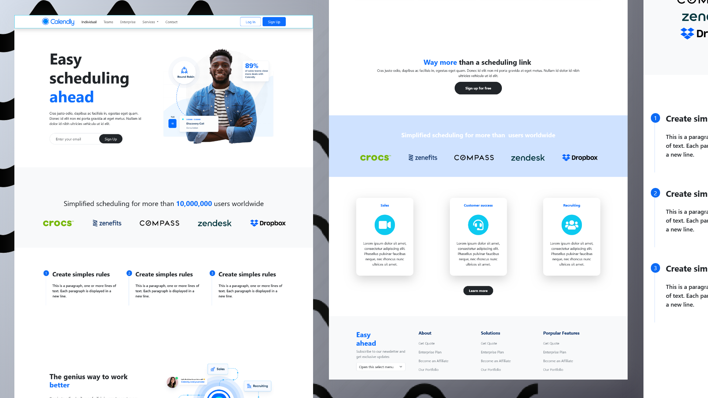

# Calendly Landling Page Old version

A responsive Calendly cloned static website with bootstrap and few line of external css ciode.


## Screenshots



<!-- ## View Live

You can view the live version of this project on GitHub Pages: [Easybank Landing Page](https://iamupo.github.io/Easybank-landing-page/) -->

## Connect with Me

Feel free to connect with me on:

- [LinkedIn](https://www.linkedin.com/in/iamupo/)
- [x](https://www.x.com/iamupo/)

## Getting Started

To get a copy of this project and run it locally, follow these steps:

1. Clone the repository:

   ```bash
   git clone https://github.com/IamUPO/Calendly-clone-old-site.git
